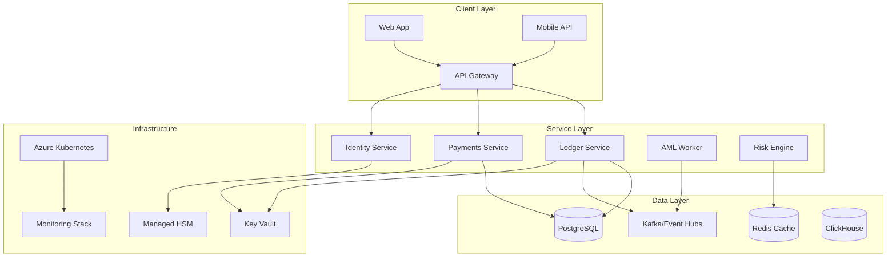

# 🏦 AtlasBank - Production-Grade Fintech Platform

[](https://github.com/your-org/atlasbank/actions)
[](LICENSE)
[](https://dotnet.microsoft.com/download)
[](https://www.docker.com/)

> **AtlasBank** is a production-ready, PCI DSS-compliant fintech platform built with .NET 8, featuring microservices architecture, real-time AML monitoring, and enterprise-grade security controls.

## 🚀 **Key Features**

### **Core Banking Services**
- **📊 Ledger Service**: Double-entry bookkeeping with SERIALIZABLE transactions
- **💸 Payments Service**: Idempotent transfers with gRPC communication
- **🛡️ AML/Risk Engine**: Real-time transaction monitoring with YAML-configurable rules
- **🔐 Identity Service**: OAuth2/OIDC with Azure AD B2C integration
- **📈 Analytics**: ClickHouse-powered reporting and compliance

### **Enterprise Architecture**
- **🏗️ Microservices**: Domain-driven design with hexagonal architecture
- **🔄 Event-Driven**: Kafka/Event Hubs with Outbox pattern for reliability
- **🌐 Multi-Tenant**: Schema-per-tenant with proper isolation
- **📊 Observability**: OpenTelemetry, Jaeger, Grafana dashboards
- **🔒 Security**: PCI DSS compliance, mTLS, HSM integration

### **Production Features**
- **⚡ High Performance**: gRPC for internal communication (7-10x faster than HTTP)
- **🛡️ Financial Integrity**: Balance validation, transaction boundaries, audit trails
- **🔄 Resilience**: Polly policies, circuit breakers, bulkheads
- **📈 Scalability**: Kubernetes-native with auto-scaling
- **🔐 Compliance**: PCI DSS, SOC 2, GDPR ready

## 🏗️ **Architecture Overview**



## 🛠️ **Technology Stack**

### **Backend**
- **.NET 8** - Latest LTS with C# 12 features
- **ASP.NET Core** - Minimal APIs with gRPC support
- **Entity Framework Core** - PostgreSQL with SERIALIZABLE transactions
- **MediatR** - CQRS pattern implementation
- **FluentValidation** - Input validation and business rules

### **Messaging & Events**
- **Kafka/Event Hubs** - Event-driven architecture
- **Confluent.Kafka** - .NET Kafka client
- **Outbox Pattern** - Reliable message delivery
- **Domain Events** - Event sourcing for audit trails

### **Infrastructure**
- **Azure Kubernetes Service (AKS)** - Container orchestration
- **Azure PostgreSQL Flexible Server** - Managed database
- **Azure Event Hubs** - Event streaming platform
- **Azure Key Vault** - Secrets management
- **Azure Managed HSM** - Hardware security modules

### **Observability**
- **OpenTelemetry** - Distributed tracing
- **Jaeger** - Trace visualization
- **Grafana** - Metrics and dashboards
- **Prometheus** - Metrics collection
- **ELK Stack** - Centralized logging

### **Security**
- **Azure AD B2C** - Identity provider
- **Duende IdentityServer** - OAuth2/OIDC server
- **mTLS** - Mutual TLS for service communication
- **OPA/Gatekeeper** - Kubernetes security policies
- **PCI DSS Compliance** - Financial data protection

## 🚀 **Quick Start**

### **Prerequisites**
- [.NET 8 SDK](https://dotnet.microsoft.com/download/dotnet/8.0)
- [Docker Desktop](https://www.docker.com/products/docker-desktop)
- [Make](https://www.gnu.org/software/make/) (optional, for convenience commands)

### **Local Development**

1. **Clone the repository**
   ```bash
   git clone https://github.com/your-org/atlasbank.git
   cd atlasbank
   ```

2. **Start all services**
   ```bash
   make up
   # or manually:
   docker-compose -f infrastructure/docker/docker-compose.yml up -d
   ```

3. **Verify services are running**
   ```bash
   make health-check
   # or manually:
   curl http://localhost:5080/health  # API Gateway
   curl http://localhost:5181/health  # Ledger Service
   curl http://localhost:5191/health  # Payments Service
   ```

4. **Test the system**
   ```bash
   # Test gRPC communication
   make payments-test
   
   # Test AML worker
   make aml-test
   
   # Monitor AML alerts
   docker logs amlworker -f
   ```

### **Service Endpoints**

| Service | HTTP Port | gRPC Port | Description |
|---------|-----------|-----------|-------------|
| **API Gateway** | 5080 | - | YARP reverse proxy |
| **Ledger Service** | 5181 | 7001 | Core accounting engine |
| **Payments Service** | 5191 | - | Transfer processing |
| **AML Worker** | - | - | Background risk monitoring |

## 📊 **API Documentation**

### **Ledger Service**

#### **Post Journal Entry (gRPC)**
```protobuf
service LedgerService {
  rpc PostEntry (PostEntryRequest) returns (PostEntryResponse);
  rpc GetBalance (GetBalanceRequest) returns (GetBalanceResponse);
}
```

#### **Post Journal Entry (HTTP)**
```http
POST /ledger/entries
Content-Type: application/json
X-Tenant-Id: tnt_demo

{
  "SourceAccountId": "acc_123",
  "DestinationAccountId": "acc_456", 
  "Minor": 50000,
  "Currency": "NGN",
  "Narration": "Transfer payment"
}
```

### **Payments Service**

#### **Transfer Funds**
```http
POST /payments/transfers
Content-Type: application/json
Idempotency-Key: unique-key-123
X-Tenant-Id: tnt_demo

{
  "SourceAccountId": "acc_123",
  "DestinationAccountId": "acc_456",
  "Minor": 50000,
  "Currency": "NGN", 
  "Narration": "Customer transfer"
}
```

## 🔧 **Configuration**

### **Environment Variables**

| Variable | Description | Default |
|----------|-------------|---------|
| `KAFKA_BOOTSTRAP` | Kafka bootstrap servers | `redpanda:9092` |
| `ConnectionStrings__Ledger` | PostgreSQL connection string | `Host=postgres;Port=5432;Database=atlas;Username=postgres;Password=postgres` |
| `Services__LedgerGrpc` | Ledger gRPC endpoint | `http://ledgerapi:5181` |
| `Rules__Path` | AML rules configuration path | `/app/config/rules/aml-rules.yaml` |

### **AML Rules Configuration**

```yaml
# config/rules/aml-rules.yaml
velocity:
  - id: high_velocity_ngn
    field: amount
    windowSeconds: 120
    thresholdMinor: 100000000  # 1M NGN
    currency: NGN
    action: STEP_UP
```

## 🚀 **Deployment**

### **Azure Deployment**

1. **Prerequisites**
   ```bash
   # Install Azure CLI
   az login
   
   # Install Terraform
   terraform --version
   ```

2. **Deploy Infrastructure**
   ```bash
   cd infrastructure/iac/terraform/azure
   terraform init
   terraform plan
   terraform apply
   ```

3. **Deploy Applications**
   ```bash
   # Build and push images
   make build-images
   make push-images
   
   # Deploy to AKS
   make deploy-aks
   ```

### **Docker Compose Deployment**

```bash
# Production deployment
docker-compose -f infrastructure/docker/docker-compose.prod.yml up -d

# Scale services
docker-compose up -d --scale ledgerapi=3 --scale paymentsapi=2
```

### **Kubernetes Deployment**

```bash
# Apply Kubernetes manifests
kubectl apply -f infrastructure/k8s/

# Check deployment status
kubectl get pods -n atlasbank
kubectl get services -n atlasbank
```

## 🧪 **Testing**

### **Unit Tests**
```bash
dotnet test
```

### **Integration Tests**
```bash
dotnet test --filter Category=Integration
```

### **Load Testing**
```bash
# Install k6
k6 run tests/load/payments-load-test.js
```

### **End-to-End Testing**
```bash
make e2e-test
```

## 📈 **Monitoring & Observability**

### **Grafana Dashboards**
- **Service Health**: http://localhost:3000/d/service-health
- **Financial Metrics**: http://localhost:3000/d/financial-metrics
- **AML Monitoring**: http://localhost:3000/d/aml-monitoring

### **Jaeger Tracing**
- **Trace UI**: http://localhost:16686

### **Health Checks**
```bash
# Check all service health
curl http://localhost:5080/health
curl http://localhost:5181/health  
curl http://localhost:5191/health
```

## 🔒 **Security**

### **PCI DSS Compliance**
- ✅ **Network Segmentation**: Isolated CDE networks
- ✅ **Data Encryption**: AES-256 at rest, TLS 1.3 in transit
- ✅ **Access Controls**: RBAC/ABAC with Azure AD B2C
- ✅ **Audit Logging**: Comprehensive audit trails
- ✅ **HSM Integration**: Azure Managed HSM for key management

### **Security Policies**
```bash
# Apply OPA/Gatekeeper policies
kubectl apply -f infrastructure/policies/gatekeeper/
```

## 📚 **Documentation**

- **[Architecture Decision Records](docs/adr/)** - Key architectural decisions
- **[API Documentation](docs/api/)** - Complete API reference
- **[Deployment Guide](docs/deployment/)** - Production deployment guide
- **[Security Guide](docs/security/)** - Security best practices
- **[Troubleshooting](docs/troubleshooting/)** - Common issues and solutions

## 🤝 **Contributing**

1. Fork the repository
2. Create a feature branch (`git checkout -b feature/amazing-feature`)
3. Commit your changes (`git commit -m 'Add amazing feature'`)
4. Push to the branch (`git push origin feature/amazing-feature`)
5. Open a Pull Request

### **Development Guidelines**
- Follow [.NET coding standards](https://docs.microsoft.com/en-us/dotnet/csharp/programming-guide/inside-a-program/coding-conventions)
- Write comprehensive unit tests
- Update documentation for new features
- Ensure all CI checks pass

## 📄 **License**

This project is licensed under the MIT License - see the [LICENSE](LICENSE) file for details.

## 🆘 **Support**

- **Documentation**: [docs/](docs/)
- **Issues**: [GitHub Issues](https://github.com/your-org/atlasbank/issues)
- **Discussions**: [GitHub Discussions](https://github.com/your-org/atlasbank/discussions)
- **Security**: security@your-org.com

## 🏆 **Acknowledgments**

- Built with ❤️ using .NET 8 and modern fintech best practices
- Inspired by Domain-Driven Design and Event-Driven Architecture
- Compliant with PCI DSS and financial industry standards

---

**AtlasBank** - *Building the future of digital banking* 🚀
